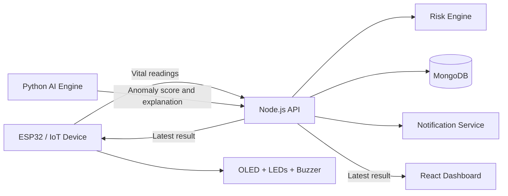

<div align="center">

# 🩺 ArogyaDrishti AI

### <span style="color:#7C3AED">See the Signal</span> · <span style="color:#2563EB">Understand the Risk</span> · <span style="color:#E11D48">Act in Time</span>

**IoT + AI-assisted remote health monitoring with explainable risk scoring, real-time alerts, and a live dashboard.**

<br />


</div>

---

## 🎨 Design Language

ArogyaDrishti AI follows a calm, medical-inspired palette that makes status changes instantly recognizable:

| Role | Color | Hex |
|---|---|---|
| Primary AI | Purple | `#7C3AED` |
| Information | Blue | `#2563EB` |
| Normal | Green | `#16A34A` |
| Attention | Amber | `#F59E0B` |
| High priority | Rose red | `#E11D48` |
| Background | Slate | `#F8FAFC` |

The visual hierarchy is intentional: **calm when stable, clear when attention is needed, and unmistakable during high-priority events.**

---

## 📖 Overview

ArogyaDrishti AI is a connected health-monitoring ecosystem that converts vital-health signals into understandable and actionable insights.

It combines:

- 🫀 ESP32-based edge hardware
- 📡 Vital-sign collection and transport
- 🧍 Personal baseline comparison
- 🔍 Machine-learning anomaly detection
- 🧠 Explainable risk scoring
- 💾 MongoDB persistence
- 🖥️ React monitoring dashboard
- 🔔 Notification-ready backend services
- 💡 LED, buzzer, and OLED feedback

Instead of displaying only raw values:

```text
❤️ Heart Rate: 145 BPM
🫁 SpO₂: 87%
```

The platform converts them into a meaningful event:

```text
🚨 HIGH PRIORITY
Risk Score: 90/100

Reasons:
- Heart rate is significantly elevated
- SpO₂ is below the configured threshold
- Multiple signals show an unusual pattern

🖥️ Dashboard updated
🔔 Notification triggered
🔴 ESP32 alert activated
```

> **Important:** This is an educational prototype. It is not a certified medical device and must not replace professional medical advice or emergency services.

---

## 🎯 The Problem It Solves

Traditional monitoring systems often show numbers without explaining what they mean. ArogyaDrishti AI connects measurement, analysis, explanation, and response in one workflow:

```text
SENSE → COLLECT → STORE → ANALYZE → EXPLAIN → ALERT → RESPOND
```

The platform helps monitoring personnel answer three questions quickly:

1. **What is happening?** — View current vital signals.
2. **Why does it matter?** — Read the score and explanation.
3. **What happens next?** — Receive dashboard, notification, and hardware alerts.

---

## ✨ Core Features

### 🫀 Multi-signal monitoring

- Heart rate — `heart_rate`
- Blood oxygen saturation — `spo2`
- Motion intensity — `motion`

### 🧠 Explainable risk scoring

Each analysis can include a `0–100` risk score, a readable status, an alert flag, and the signals that contributed to the decision.

### 📊 Live dashboard

The React dashboard provides:

- Current heart-rate, SpO₂, and motion cards
- Automatic polling every two seconds
- Heart-rate and SpO₂ trend charts
- Risk status visualization
- AI explanation panel
- Last-update timestamp

### 🧍 Personal baseline awareness

The AI engine maintains baseline values for heart rate, SpO₂, and motion. New readings are compared against those values to identify meaningful deviations.

### 🔍 Anomaly detection

The Python service uses an `IsolationForest` model to identify unusual combinations of vital readings and baseline deviations.

### 🔔 Notification-ready backend

Whenever a reading is not `NORMAL`, the backend can trigger the notification service. This provides an extension point for email, SMS, push notifications, WhatsApp, or caregiver webhooks.

---

## 🔌 Hardware Wiring Diagram

The ESP32 unit connects the alert LEDs, buzzer, analog input modules, and OLED display into one local monitoring device.


> **Repository image path:** Save the uploaded wiring image as `docs/esp32-wiring-diagram.png` so it renders automatically on GitHub. The diagram above is intentionally linked to that repository path.

### Hardware behavior

| Status | LED | Buzzer | Meaning |
|---|---|---|---|
| `NORMAL` | 🟢 Green | Off | Signals are within the configured range |
| `ATTENTION` | 🟡 Yellow | Short beep | Signals differ from the expected pattern |
| `HIGH_PRIORITY` | 🔴 Red | Continuous tone | Immediate review is recommended in the prototype workflow |

### Pin mapping

| Component | ESP32 GPIO / Address |
|---|---:|
| Green LED | `16` |
| Yellow LED | `17` |
| Red LED | `18` |
| Buzzer | `19` |
| OLED I²C address | `0x3C` |

---

## 🏗️ System Architecture



### Data flow

1. The device captures or receives vital readings.
2. The backend validates and analyzes the payload.
3. Risk analysis combines thresholds, baseline deviations, and anomaly signals.
4. The result is persisted in MongoDB.
5. Notifications are triggered for non-normal statuses.
6. The dashboard polls and visualizes the latest result.
7. The ESP32 polls the status and activates local feedback.

---

## 📁 Project Structure

```text
.
├── ai-engine/
│   ├── app.py                 # Flask AI API and /analyze endpoint
│   ├── baseline.py            # Personal baseline management
│   ├── features.py            # Feature and deviation extraction
│   ├── model.py               # IsolationForest anomaly model
│   ├── risk.py                # Explainable risk calculation
│   └── requirements.txt
│
├── backend/
│   ├── models/                # Mongoose models
│   ├── routes/vitals.js       # Vital ingestion and query routes
│   ├── services/              # Risk and notification services
│   ├── server.js              # Express entry point
│   └── .env
│
├── frontend/
│   ├── src/App.jsx            # Dashboard UI and polling logic
│   ├── src/App.css            # Dashboard styles
│   ├── src/main.jsx
│   └── package.json
│
├── vitalsentry/
│   ├── src/main.cpp           # ESP32 firmware
│   ├── platformio.ini
│   ├── diagram.json           # Wokwi circuit diagram
│   └── wokwi.toml
│
├── docs/
│   └── esp32-wiring-diagram.png
│
└── README.md
```

---

## 🧮 Risk Intelligence

### Risk levels

| Score | Status | Interpretation |
|---:|---|---|
| `0–24` | 🟢 `NORMAL` | Signals are within the configured range |
| `25–59` | 🟡 `ATTENTION` | One or more signals differ from the expected pattern |
| `60–100` | 🔴 `HIGH_PRIORITY` | The reading requires immediate review in the prototype workflow |

### Current scoring signals

The current risk logic considers:

- Heart rate above `130 BPM`
- Heart rate more than `25 BPM` above baseline
- SpO₂ below `90%`
- SpO₂ below `94%`
- Motion deviation greater than `2`
- Anomaly score greater than `60`

The score is capped at `100`, and explanations are returned with the result.

### AI feature vector

```text
[
  heart_rate,
  spo2,
  motion,
  heart_rate_deviation,
  spo2_deviation,
  motion_deviation
]
```

---

## 🧰 Technology Stack

| Layer | Technologies |
|---|---|
| Frontend | React, Vite, Recharts, CSS |
| Backend | Node.js, Express, Mongoose, MongoDB, Axios, CORS, dotenv |
| AI engine | Python, Flask, NumPy, Pandas, scikit-learn, Requests |
| Embedded | ESP32, Arduino, PlatformIO, Wi-Fi, HTTPS, ArduinoJson |
| Display and alerts | SSD1306 OLED, Adafruit GFX, LEDs, buzzer |
| Simulation | Wokwi |

---

## 🚀 Getting Started

### Prerequisites

- Node.js 18+ and npm
- Python 3.9+
- MongoDB or MongoDB Atlas
- PlatformIO for ESP32 development
- Wokwi for simulation, if required

### 1. Clone the repository

```bash
git clone https://github.com/priyam63p/iotricity-3.o.git
cd iotricity-3.o
```

### 2. Start the backend

```bash
cd backend
npm install
node server.js
```

The backend uses `PORT` from the environment and defaults to port `3000`.

### 3. Start the AI engine

```bash
cd ai-engine
python -m venv .venv

# macOS/Linux
source .venv/bin/activate

# Windows PowerShell
# .venv\Scripts\Activate.ps1

pip install -r requirements.txt
python app.py
```

The Flask service runs on port `5000`.

### 4. Start the frontend

```bash
cd frontend
npm install
npm run dev
```

Open the local URL printed by Vite, normally `http://localhost:5173`.

### 5. Build and lint the frontend

```bash
npm run lint
npm run build
```

### 6. Run the ESP32 project

```bash
cd vitalsentry
pio run
pio run --target upload
pio device monitor
```

For simulation, open the `vitalsentry/` directory in Wokwi with the included `diagram.json` and `wokwi.toml` files.

---

## 🔌 API Reference

| Method | Endpoint | Purpose |
|---|---|---|
| `GET` | `/` | Backend health check |
| `POST` | `/api/vitals` | Analyze and store a vital reading |
| `GET` | `/api/vitals/latest` | Return the latest reading |
| `GET` | `/api/vitals/history/:patientId` | Return patient history |
| `POST` | `http://localhost:5000/analyze` | Run AI analysis |

### Example high-priority reading

```bash
curl -X POST http://localhost:3000/api/vitals \
  -H "Content-Type: application/json" \
  -d '{
    "patientId": "demo-patient",
    "heart_rate": 145,
    "spo2": 87,
    "motion": 4.2
  }'
```

### Example AI analysis

```bash
curl -X POST http://localhost:5000/analyze \
  -H "Content-Type: application/json" \
  -d '{
    "heart_rate": 145,
    "spo2": 87,
    "motion": 4.2
  }'
```

---

## 🔐 Environment Variables

Create `backend/.env` locally:

```env
MONGO_URI=mongodb://127.0.0.1:27017/arogyadrishti
PORT=3000
```

Never commit real credentials, private health data, API keys, or notification-provider secrets.

---

## 🔧 ESP32 Configuration

Update the backend URL in `vitalsentry/src/main.cpp`:

```cpp
const char* BACKEND_URL = "https://your-public-backend.example.com";
```

The firmware appends `/api/vitals/latest`. For a local backend accessed by a simulator or external device, use a secure HTTPS tunnel.

> The prototype currently uses `client.setInsecure()` for HTTPS. Production deployments should validate server certificates.

---

## 🛣️ Roadmap

- [ ] Authentication and role-based access
- [ ] Multiple patients and caregiver accounts
- [ ] Temperature and blood-pressure sensors
- [ ] WebSocket or Server-Sent Events updates
- [ ] Patient-specific baseline learning
- [ ] Automated tests for all services
- [ ] Docker Compose deployment
- [ ] Secure TLS validation on ESP32
- [ ] Configurable notification channels
- [ ] Audit logs and privacy-focused retention
- [ ] Model evaluation and drift monitoring

---

## 🤝 Contributing

1. Fork the repository.
2. Create a branch: `git checkout -b feature/your-feature-name`
3. Make your changes and add tests where appropriate.
4. Run lint, build, and service checks.
5. Commit with a clear message.
6. Open a pull request describing the implementation and validation.

Please never include real patient information, credentials, or private keys in commits or issues.

---

## ⚠️ Safety Notice

ArogyaDrishti AI is an educational prototype. Its thresholds, model outputs, risk scores, and alerts have not been clinically validated. Do not use this project to diagnose, treat, or monitor a medical condition without qualified professional supervision. In an emergency, contact local emergency services.

---

## 📄 License

No license has been declared in the repository yet. Until a license is added, all rights remain with the repository owner.

---

<div align="center">

### Built to make health signals more visible, understandable, and actionable.

**ArogyaDrishti AI — Observe early. Explain clearly. Respond quickly.**

</div>
