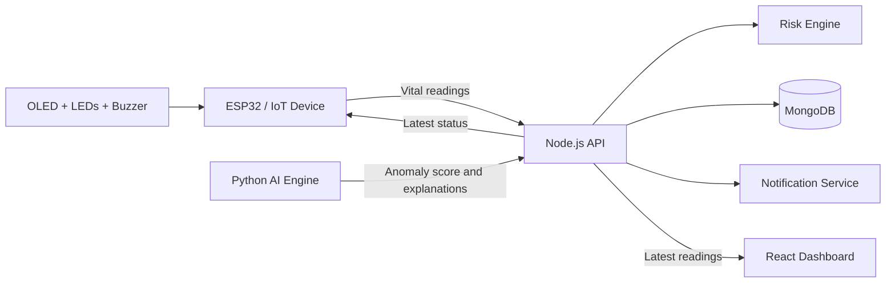

<div align="center">

# 🩺 ArogyaDrishti AI

### See the Signal. Understand the Risk. Act in Time.

**An IoT + AI-assisted remote health monitoring and early-warning platform** built to transform vital signs into clear, explainable, and actionable health insights.

<br />


</div>

---

## 📌 Table of Contents

- [Overview](#-overview)
- [The Problem](#-the-problem)
- [Core Capabilities](#-core-capabilities)
- [How It Works](#-how-it-works)
- [System Architecture](#-system-architecture)
- [Project Structure](#-project-structure)
- [Risk Intelligence](#-risk-intelligence)
- [Technology Stack](#-technology-stack)
- [Getting Started](#-getting-started)
- [API Reference](#-api-reference)
- [ESP32 and Wokwi Setup](#-esp32-and-wokwi-setup)
- [Environment Variables](#-environment-variables)
- [Example Payloads](#-example-payloads)
- [Development Notes](#-development-notes)
- [Roadmap](#-roadmap)
- [Safety Notice](#-safety-notice)
- [Contributing](#-contributing)
- [License](#-license)

---

## 🌟 Overview

ArogyaDrishti AI is a connected health-monitoring ecosystem that combines:

- **ESP32-based edge hardware**
- **Vital-sign data collection and transport**
- **A Node.js and Express API layer**
- **MongoDB persistence for readings and history**
- **Rule-based risk analysis**
- **A Python-based anomaly detection engine**
- **A React dashboard with live charts**
- **Visual and audible hardware alerts**

Instead of only displaying values such as:

```text
❤️ Heart Rate: 145 BPM
🫁 SpO₂: 87%
```

the platform converts the readings into an understandable response:

```text
🚨 HIGH PRIORITY
Risk Score: 90/100

Reasons:
- Heart rate is significantly elevated
- SpO₂ is below the configured threshold
- Multiple signals show an unusual pattern

📱 Notification triggered
🖥️ Dashboard updated
🔴 ESP32 alert activated
```

The goal is to make remote monitoring more useful by connecting **measurement**, **analysis**, **explanation**, and **response** in one workflow.

> **Important:** This project is a prototype and demonstration system. It is not a certified medical device and must not be used as a substitute for professional medical advice or emergency services.

---

## 🎯 The Problem

Traditional monitoring solutions often stop at showing numbers. That creates several challenges:

- A caregiver may not know whether a value is truly abnormal for a specific person.
- Multiple moderate changes can be difficult to interpret together.
- Important alerts can be missed when nobody is watching the dashboard.
- Raw data does not explain why a reading requires attention.
- Hardware, backend services, analytics, and visualization are often disconnected.

ArogyaDrishti AI addresses these challenges with a pipeline designed around timely, explainable action:

```text
SENSE → COLLECT → STORE → ANALYZE → EXPLAIN → ALERT → RESPOND
```

---

## ✨ Core Capabilities

### 🫀 Multi-signal monitoring

The platform works with key signals including:

- Heart rate (`heart_rate`)
- Blood oxygen saturation (`spo2`)
- Motion intensity (`motion`)

### 🧠 Explainable risk scoring

Every risk decision can include:

- A normalized score from `0` to `100`
- A readable status
- The signals that contributed to the result
- An alert flag for downstream devices and services

### 📊 Live monitoring dashboard

The React dashboard provides:

- Current heart rate, SpO₂, and motion cards
- Automatic polling of the latest backend reading
- Heart-rate and SpO₂ trend charts
- Risk status visualization
- Risk score display
- Human-readable AI explanations
- Timestamp and demo-patient context

### 🔔 Notification-ready backend

The backend invokes the notification service whenever a reading is not in the `NORMAL` state. This creates a clear extension point for email, SMS, push notifications, WhatsApp, or caregiver integrations.

### 💡 Hardware feedback

The ESP32 reflects the risk state locally:

| Status | Indicator | Behavior |
|---|---|---|
| `NORMAL` | Green LED | No buzzer alarm |
| `ATTENTION` | Yellow LED | Short warning beep |
| `HIGH_PRIORITY` | Red LED | Continuous high-priority buzzer |

The OLED display shows the current status, heart rate, SpO₂, and risk score.

### 🧍 Personal baseline comparison

The AI engine maintains a baseline containing average values for:

- Heart rate
- SpO₂
- Motion

Incoming readings are compared with the baseline so that the system can detect meaningful deviations rather than relying only on fixed thresholds.

### 🔍 Anomaly detection

The Python service uses an `IsolationForest` model to identify unusual combinations of vital-sign features and baseline deviations.

---

## 🔄 How It Works

### 1. Capture or receive vital signs

The system receives heart rate, SpO₂, and motion values from an IoT device or another data source.

### 2. Validate and analyze the reading

The Node.js API validates the payload and calculates a risk result using the backend risk engine. The Python AI service can additionally extract features, compare them with a personal baseline, and calculate an anomaly score.

### 3. Persist the result

The backend stores the original measurements together with the calculated status, risk score, alert flag, explanation, patient ID, and timestamp in MongoDB.

### 4. Notify when needed

If the result is `ATTENTION` or `HIGH_PRIORITY`, the notification service is called.

### 5. Update the dashboard

The React application polls `GET /api/vitals/latest` every two seconds and updates the cards, chart history, status indicator, and explanation panel.

### 6. Activate the physical response

The ESP32 polls the latest backend result and maps the status to LEDs, a buzzer, and the OLED display.

---

## 🏗️ System Architecture



### Main components

| Component | Responsibility |
|---|---|
| `vitalsentry/` | ESP32 firmware, Wi-Fi connectivity, backend polling, OLED display, LEDs, and buzzer |
| `backend/` | REST API, validation, risk calculation, notifications, and MongoDB persistence |
| `ai-engine/` | Flask API, feature extraction, baseline comparison, anomaly detection, and risk analysis |
| `frontend/` | React/Vite dashboard for visualization and monitoring |

---

## 📁 Project Structure

```text
.
├── ai-engine/
│   ├── app.py                 # Flask AI service and /analyze endpoint
│   ├── baseline.py            # Personal baseline management
│   ├── features.py            # Feature extraction and deviation features
│   ├── model.py               # IsolationForest anomaly model
│   ├── risk.py                # Explainable AI risk calculation
│   └── requirements.txt       # Python dependencies
│
├── backend/
│   ├── models/                # MongoDB/Mongoose models
│   ├── routes/
│   │   └── vitals.js          # Vital ingestion and query endpoints
│   ├── services/              # Risk and notification services
│   ├── server.js              # Express application entry point
│   ├── package.json
│   └── .env                   # Local environment configuration
│
├── frontend/
│   ├── src/
│   │   ├── App.jsx            # Dashboard UI and polling logic
│   │   ├── App.css             # Dashboard styles
│   │   └── main.jsx            # React entry point
│   ├── package.json
│   └── vite.config.js
│
├── vitalsentry/
│   ├── src/main.cpp           # ESP32 firmware
│   ├── platformio.ini         # PlatformIO configuration
│   ├── diagram.json           # Wokwi circuit diagram
│   └── wokwi.toml             # Wokwi project configuration
│
└── README.md
```

---

## 🧮 Risk Intelligence

The backend and AI service use a combination of fixed clinical-style thresholds, personal baseline deviations, motion changes, and anomaly scores.

### Risk statuses

| Risk score | Status | Meaning |
|---:|---|---|
| `0–24` | `NORMAL` | Signals are within the configured range. |
| `25–59` | `ATTENTION` | One or more signals differ from the expected pattern. |
| `60–100` | `HIGH_PRIORITY` | The reading requires immediate review in the prototype workflow. |

### Example scoring signals

The current AI risk logic includes rules such as:

- Heart rate above `130 BPM` increases risk significantly.
- Heart rate more than `25 BPM` above baseline increases risk.
- SpO₂ below `90%` adds a high-risk contribution.
- SpO₂ below `94%` adds an attention-level contribution.
- Motion that differs substantially from baseline adds risk.
- A high anomaly score adds an unusual-pattern contribution.

The final score is capped at `100`, and the reasons are returned alongside the status so the result is easier to understand and act upon.

### Feature extraction

The AI engine derives six model features:

```text
[heart_rate,
 spo2,
 motion,
 heart_rate_deviation,
 spo2_deviation,
 motion_deviation]
```

The anomaly model is initialized with `IsolationForest`, trained on demonstration data, and returns both an anomaly flag and a normalized anomaly score.

---

## 🧰 Technology Stack

### Frontend

- React
- Vite
- Recharts
- Modern CSS with responsive dashboard styling

### Backend

- Node.js
- Express
- Mongoose
- MongoDB
- Axios
- CORS
- dotenv

### AI engine

- Python
- Flask
- NumPy
- Pandas
- scikit-learn
- Requests

### Embedded system

- ESP32 DevKit
- Arduino framework
- PlatformIO
- Adafruit SSD1306 OLED library
- Adafruit GFX library
- ArduinoJson
- Wi-Fi and HTTPS client support

---

## 🚀 Getting Started

### Prerequisites

Install the following before running the project:

- Node.js 18+ and npm
- Python 3.9+
- MongoDB or a MongoDB Atlas connection
- PlatformIO, if running the ESP32 firmware locally
- Wokwi, if simulating the hardware

### 1. Clone the repository

```bash
git clone https://github.com/priyam63p/iotricity-3.o.git
cd iotricity-3.o
```

### 2. Start the backend

```bash
cd backend
npm install
npm start
```

The backend uses `PORT` from the environment and falls back to port `3000`.

> If the project does not yet define an `npm start` script in your local branch, run the server directly with `node server.js`, or add a start script to `backend/package.json`.

### 3. Start the AI engine

Open another terminal:

```bash
cd ai-engine
python -m venv .venv

# macOS/Linux
source .venv/bin/activate

# Windows PowerShell
# .venv\Scripts\Activate.ps1

pip install -r requirements.txt
python app.py
```

The Flask service listens on port `5000`.

Health check:

```bash
curl http://localhost:5000/
```

### 4. Start the frontend

Open another terminal:

```bash
cd frontend
npm install
npm run dev
```

Open the local URL printed by Vite, usually `http://localhost:5173`.

The dashboard currently requests data from:

```text
http://localhost:3000/api/vitals/latest
```

Update this URL in `frontend/src/App.jsx` when deploying the backend elsewhere.

### 5. Run the ESP32 project

Using PlatformIO:

```bash
cd vitalsentry
pio run
pio run --target upload
pio device monitor
```

For Wokwi, open the `vitalsentry/` project and run the simulation using the included `diagram.json` and `wokwi.toml` files.

---

## 🔌 API Reference

### Health checks

#### `GET /`

Backend health check.

Example response:

```json
{
  "project": "VitalSentry AI",
  "status": "Backend running"
}
```

#### `GET http://localhost:5000/`

AI-engine health check.

Example response:

```json
{
  "service": "VitalSentry AI Engine",
  "status": "running"
}
```

### Vital endpoints

#### `POST /api/vitals`

Receives a vital-sign reading, analyzes it, optionally triggers a notification, and saves it to MongoDB.

Required fields:

- `heart_rate`
- `spo2`

Optional fields:

- `patientId`
- `motion`

#### `GET /api/vitals/latest`

Returns the most recently stored reading.

#### `GET /api/vitals/history/:patientId`

Returns up to 100 readings for a patient, newest first.

### AI endpoint

#### `POST http://localhost:5000/analyze`

Analyzes a reading using baseline comparison, feature extraction, anomaly detection, and explainable risk scoring.

Required fields:

- `heart_rate`
- `spo2`

Optional fields:

- `motion`

---

## 🧪 Example Payloads

### Submit a normal reading

```bash
curl -X POST http://localhost:3000/api/vitals \
  -H "Content-Type: application/json" \
  -d '{
    "patientId": "demo-patient",
    "heart_rate": 75,
    "spo2": 98,
    "motion": 1.0
  }'
```

### Submit a high-risk reading

```bash
curl -X POST http://localhost:3000/api/vitals \
  -H "Content-Type: application/json" \
  -d '{
    "patientId": "demo-patient",
    "heart_rate": 145,
    "spo2": 87,
    "motion": 4.2
  }'
```

### Analyze a reading with the AI engine

```bash
curl -X POST http://localhost:5000/analyze \
  -H "Content-Type: application/json" \
  -d '{
    "heart_rate": 145,
    "spo2": 87,
    "motion": 4.2
  }'
```

Example AI response shape:

```json
{
  "success": true,
  "vitals": {
    "heart_rate": 145,
    "spo2": 87,
    "motion": 4.2
  },
  "baseline": {
    "heart_rate": 75,
    "spo2": 98,
    "motion": 1.0
  },
  "anomaly": {
    "detected": true,
    "score": 90
  },
  "risk": {
    "risk_score": 100,
    "status": "HIGH_PRIORITY",
    "reasons": [
      "Heart rate is significantly elevated",
      "SpO₂ is below the configured threshold",
      "Motion pattern differs from baseline",
      "Multiple signals show an unusual pattern"
    ]
  }
}
```

---

## 🔐 Environment Variables

Create `backend/.env` locally and never commit real credentials:

```env
MONGO_URI=mongodb://127.0.0.1:27017/arogyadrishti
PORT=3000
```

Depending on the notification implementation, you may also add provider-specific settings such as email, SMS, or webhook credentials.

For local development, keep secrets out of source files and use a secret manager or deployment platform environment variables in production.

---

## 🔧 ESP32 and Wokwi Setup

The firmware is configured for an `esp32dev` board and uses the following libraries:

- `electroniccats/MPU6050`
- `adafruit/Adafruit SSD1306`
- `adafruit/Adafruit GFX Library`
- `bblanchon/ArduinoJson`

Before running the firmware, update the backend URL in `vitalsentry/src/main.cpp`:

```cpp
const char* BACKEND_URL = "https://your-public-backend.example.com";
```

The firmware appends:

```text
/api/vitals/latest
```

For a local backend that must be accessed by a simulator or external device, expose it through a secure tunnel such as ngrok and use the generated HTTPS address.

> The current prototype uses `client.setInsecure()` for HTTPS connectivity. This is convenient for demos, but production deployments should validate server certificates.

### Hardware pin mapping

| Component | ESP32 GPIO |
|---|---:|
| Green LED | 16 |
| Yellow LED | 17 |
| Red LED | 18 |
| Buzzer | 19 |
| OLED I²C address | `0x3C` |

---

## 🧭 Development Notes

- The dashboard polls the latest vital every two seconds and keeps the most recent 20 points for chart display.
- The backend stores both the measurements and the derived risk metadata.
- The AI engine currently includes demonstration training data and a default personal baseline.
- The backend and AI engine expose separate services; deployment can combine them behind an API gateway or connect them through an internal HTTP call.
- The ESP32 firmware is currently backend-driven: it fetches the latest analyzed status and displays or signals it locally.
- Replace demo patient data, thresholds, notification providers, and model training data before using the project in a real deployment.

---

## 🛣️ Roadmap

- [ ] Add production-grade authentication and role-based access
- [ ] Support multiple patients and caregiver accounts
- [ ] Connect additional sensors such as temperature and blood pressure
- [ ] Add real-time WebSocket or Server-Sent Events updates
- [ ] Improve baseline learning with patient-specific historical data
- [ ] Add model evaluation, validation, and monitoring dashboards
- [ ] Add automated tests for frontend, backend, firmware, and AI services
- [ ] Add Docker Compose for one-command local deployment
- [ ] Add secure TLS certificate validation on ESP32
- [ ] Add configurable alert channels and escalation policies
- [ ] Add audit logs and privacy-focused data retention policies

---

## ⚠️ Safety Notice

ArogyaDrishti AI is an educational and prototype project. Its thresholds, model output, risk scores, and alerts are not clinically validated. Do not use it to diagnose, treat, or monitor a medical condition without qualified professional supervision. In an emergency, contact local emergency services.

---

## 🤝 Contributing

Contributions are welcome.

1. Fork the repository.
2. Create a feature branch:

   ```bash
   git checkout -b feature/your-feature-name
   ```

3. Make your changes and add tests where appropriate.
4. Run the relevant lint, build, and service checks.
5. Commit your changes with a clear message.
6. Open a pull request describing the problem, implementation, and validation steps.

For security-sensitive issues, avoid posting credentials or private health data in public issues.

---

## 📄 License

No license has been declared in the repository yet. Until a license is added, all rights remain with the repository owner. Add an appropriate open-source license before inviting external reuse or redistribution.

---

<div align="center">

### Built to make health signals more understandable, visible, and actionable.

**ArogyaDrishti AI — Observe early. Explain clearly. Respond quickly.**

</div>
